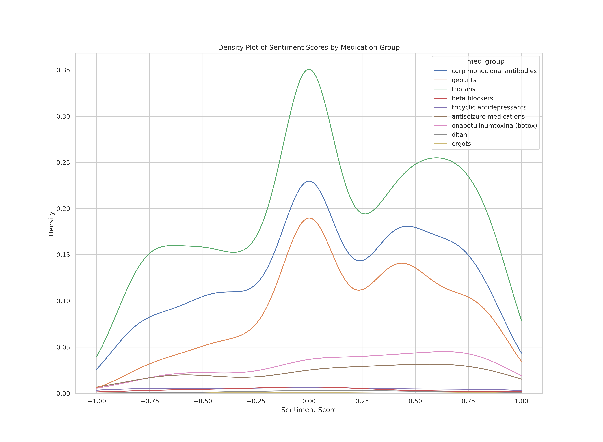

# Project Migraine: Part 2


## 💊Migraine Medications Considered
### Commonly Used Migraine **Preventive** Medications

| Medication Group             | Generic Medication (US Brand Name)                                                                                                      |
|------------------------------|------------------------------------------------------------------------------------------------------------------|
| Antiseizure medications         | Topiramate (Topamax)                                                                                             |
| Beta Blockers        | Propranolol (Inderal), Atenolol (Tenormin), Metoprolol (Toprol)                                                                                            |
| Tricyclic antidepressants    | Amitriptyline (Elavil), Nortriptyline (Pamelor)                                                                                           |
| OnabotulinumtoxinA (Botox)   | OnabotulinumtoxinA (Botox)                                                                                       |
| CGRP monoclonal antibodies   | erenumab (Aimovig), galcanezumab (Emgality), fremanezumab (Ajovy), eptinezumab (Vyepti)                          |
| Gepants                      | Atogepant (Qulipta), rimegepant (Nurtec)                                                                         |

### Commonly Used Migraine **Acute** Medications

| Medication Group | Generic Medication (US Brand Name)                                                                                                                    |
|------------------|--------------------------------------------------------------------------------------------------------------------------------|
| Triptans         | Sumatriptan (Imitrex), Rizatriptan (Maxalt), Eletriptan (Relpax), Naratriptan (Amerge), Frovatriptan (Frova), Zolmitriptan (Zomig), Almotriptan (Axert) |
| Gepants          | ubrogepant (Ubrelvy), rimegepant (Nurtec), zavegepant (Zavzpret)                                                              |
| Ditan            | Lasmiditan (Reyvow)                                                                                                            |
| Ergots           | Dihydroergotamine (DHE, Migranal, Trudhesa), ergotamine (Cafergot)                                                             |


## 🎯Tested Environment
The project has been tested on the following configurations:
- Operating System: Ubuntu 20.04.5 LTS
- NVIDIA-SMI 525.60.13
- Driver Version: 525.60.13
- CUDA Version: 12.0

## 👩‍💻Installing Conda environment:
1. Activate Conda in bash
2. Install packages using following command:
```
$ conda env create -f installations/environment.yml
```
3. If you only want to install packages without version: ```conda create --name <env-name> --file installations/packages.txt```
4. Install any remaining packages using pip as follows:
```
$ pip install -r installations/requirements.txt
```
## 🏃Running the Classification Code
1. Clone the repositry: ```git clone https://github.com/swati-rajwal/migraine.git```
2. Get access to dataset, not publicly shared at the moment. Alternatively, you can use this pipeline to your own dataset as well. Put the dataset in ```data``` folder
3. ```A_Dataset.py``` file is written specifically for the dataset we have. If you have access to our dataset, this file should work. Else, you will have to pr-process your data accordingly.
4. Create dataset splits: ```python B_nfold_split.py <csv_file_path> <output_folder_path>```
5. Run ```chmod +x C_1_run_cls_multiGPU.sh``` to ensure you have rights to run this file.
6. Run ```C_1_run_cls_multiGPU.sh``` that in turn runs the ```C_2_simpletransformers_cls.py``` file for RoBERTa based classification
7. As an example, you can run a command like ```./C_1_run_cls_multiGPU.sh &> results/roberta_run_$(date +%Y-%m-%d).log```
8. If you re-run step 4, make sure to either delete or rename the folder 'model'
9. For evaluation, run ```python D_eval_model.py task_configs/migraine.json &> results/eval_run_$(date +%Y-%m-%d).log``` command.
10. To understand the sentiment across various medication groups, run ```python E_sentiment_analysis.py```